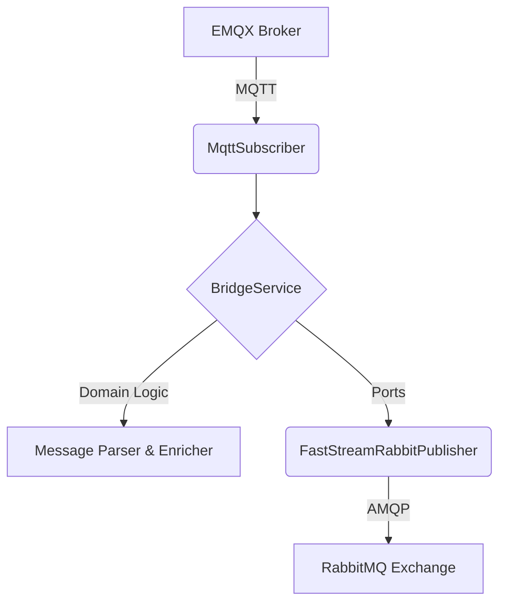

# EMQX Bridge Service

[](https://github.com/phomreeb/emqx-bridge-service/actions/workflows/ci.yml)
[](https://www.python.org/downloads/release/python-3130/)
[](https://faststream.airt.ai/)

A high-performance IoT Middleware service built with **Python 3.13** and **FastStream**.
This service acts as a bridge between an EMQX (MQTT) broker and RabbitMQ (AMQP). It intercepts MQTT messages, parses the topics, enriches the JSON payloads, and reliably forwards them to a RabbitMQ exchange.

## 🏗 Architecture

This project is built using **Hexagonal Architecture (Ports and Adapters)** to decouple the core business logic from external frameworks and infrastructure:



* **Core (Domain)**: Pure Python logic for parsing MQTT topics (`[Org]/[Project]/[Device-ID]/[Action]`), extracting `device_id`, generating AMQP routing keys, and enriching payloads.
* **Application (Ports & Services)**: Use case orchestrator (`BridgeService`) and abstract interfaces (`MessagePublisher`).
* **Infrastructure (Adapters)**: External connections including `aiomqtt` (for EMQX), `FastStream` (for RabbitMQ), and configuration management (`pydantic-settings`).

## ✨ Key Features

* **Robust MQTT Subscription**: Connects to EMQX with automatic reconnection and supports MQTT5 Shared Subscriptions (`$share/group/topic`) for horizontal scaling.
* **Dynamic Topic Translation**: Converts MQTT wildcard topics (e.g., `org/project/+/telemetry`) into AMQP routing keys (e.g., `org.project.device_001.telemetry`).
* **Payload Enrichment**: Safely parses JSON payloads and injects the `device_id`. Handles malformed non-JSON data by wrapping it into a standard JSON structure.
* **Resilient Publishing**: Built-in retry logic when publishing to RabbitMQ to prevent data loss.
* **Production-Ready Logging**: Uses `structlog` for structured JSON logging in production and colorful, readable logs during development.
* **Type Safety & Quality**: Strictly typed with `mypy` and linted by `ruff`. High test coverage guaranteed via GitHub Actions.

## ⚙️ EMQX Rule Engine Setup

To route messages properly from EMQX to this bridge service, you can use the EMQX Rule Engine. Configure a rule with the following SQL query and action payload template:

**SQL Query:**

```sql
SELECT
  payload,
  topic,
  CASE
    WHEN is_not_null(user_properties."x-trace-id") THEN user_properties."x-trace-id"
    WHEN is_not_null(payload.trace_id) AND payload.trace_id != 'undefined' THEN payload.trace_id
    ELSE id
  END AS trace_id
FROM
  "org/#"
```

**Action Payload Template:**

```json
{
  "payload": ${payload},
  "topic": "${topic}",
  "trace_id": "${trace_id}"
}
```

## 🚀 Getting Started

### Prerequisites

* Python >= 3.13
* [uv](https://github.com/astral-sh/uv) (Fast Python package installer and resolver)
* Docker and Docker Compose (For full local testing)

### 1. Installation

Clone the repository and install the dependencies using the provided Makefile:

```bash
make install
```

### 2. Configuration

Copy the example environment file and adjust the parameters to match your setup:

```bash
cp .env.example .env
```

**Environment Variables Table:**

| Variable | Default Value | Description |
| :--- | :--- | :--- |
| `ENVIRONMENT` | `development` | Set to `production` for JSON logging. |
| `MQTT_HOST` | `localhost` | The hostname of your EMQX broker. |
| `MQTT_PORT` | `1883` | The MQTT port. |
| `MQTT_SHARE_GROUP` | *None* | MQTT5 Share group for horizontal scaling. |
| `RABBITMQ_URL` | *None* | Full AMQP connection string. |
| `RABBITMQ_PUBLISH_MAX_RETRIES` | `3` | Retries upon publish failure. |

### 3. Running Locally with Docker Compose

You can easily spin up EMQX, RabbitMQ, and the bridge service for local testing using Docker Compose:

```bash
docker compose up -d
```

* EMQX Dashboard: `http://localhost:18083` (admin / public)
* RabbitMQ Management UI: `http://localhost:15672` (guest / guest)

### 4. Running the Service (Development)

You can run the service locally without Docker using:

```bash
make run
```

### 5. Running Tests and Checks

The project includes a comprehensive test suite and type checking setup:

```bash
make test        # Run unit tests and generate coverage report
make typecheck   # Run strict type checking with mypy
make lint        # Run linter
make format      # Auto-format the code
```

## 🛠 Available Makefile Commands

* `make install` - Install dependencies using uv.
* `make run` - Run the application.
* `make test` - Run unit tests and coverage.
* `make typecheck` - Run static type checking (mypy).
* `make lint` - Run linter (`ruff check`).
* `make format` - Run formatter (`ruff format`).
* `make clean` - Remove cached files (e.g., `__pycache__`, `.mypy_cache`).

## 🐳 Docker Deployment

The project includes an optimized `Dockerfile` leveraging `uv` for fast dependency installation.

**Build the image:**

```bash
docker build -t emqx-bridge-service .
```

**Run the container:**

```bash
docker run -d \
  --name emqx-bridge \
  --env-file .env \
  --network host \
  emqx-bridge-service
```
